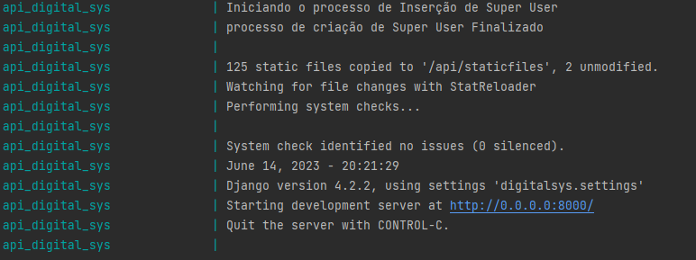
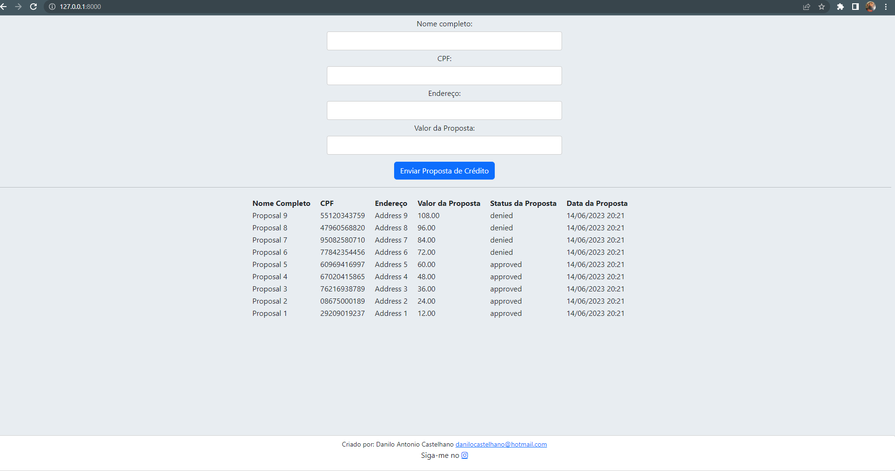
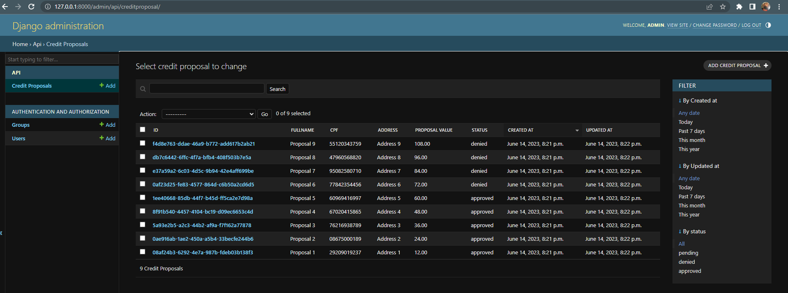
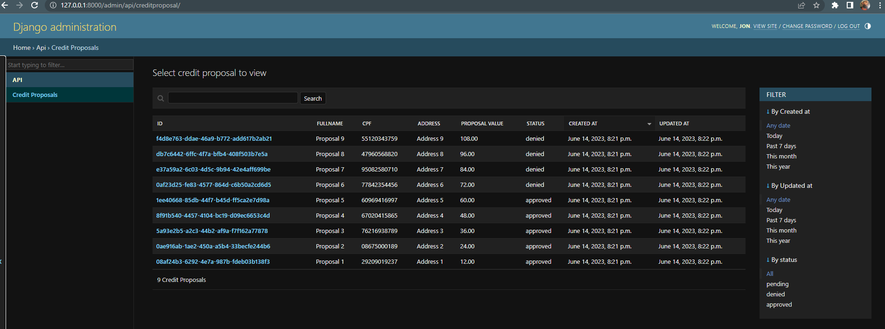
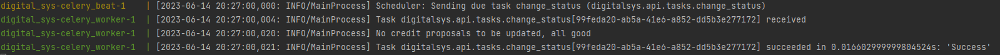
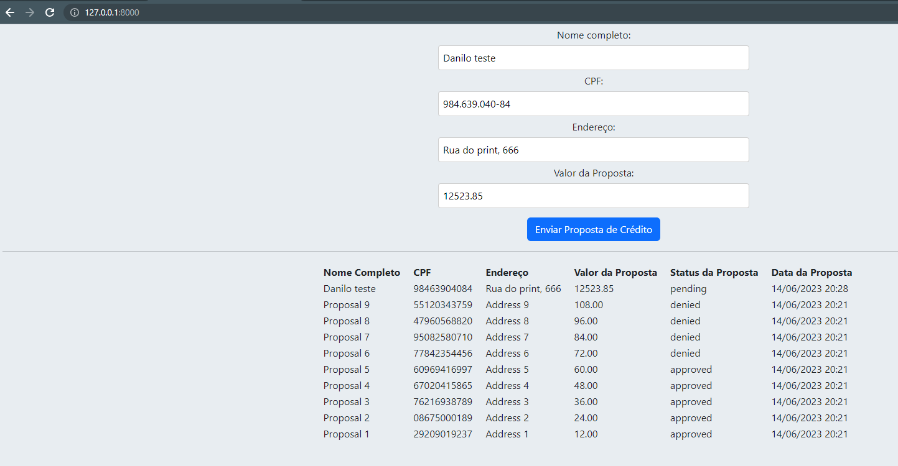

# Sistema de Gestão de Propostas de Empréstimo Pessoal

## Stacks usadas:
- Django
- Django Rest Framework (API)
- Docker (Contendo todos os recursos para funcionar) 
- Postgres
- Celery (Worker para lidar com a task)
- Celery beat (cronjob para disparar a task a cada x minutes)
- Redis

## Passo a passo:
- Baixe o código
- Renomeie o .env-exemplo para .env
- Apenas ```docker-compose up --build``` e esperar o build finalizar!

Uma vez que o docker esteja rodando, não deve ter problemas com a aplicação
- Para testar a página criada para incluir propostas de crédito, acesse: ``http://127.0.0.1:8000``
- Para testar o admin e a conta comum, acesse: ``http://127.0.0.1:8000/admin``


### Eu estou enviando uma cópia da collection do postman, para testar por lá também:
```DigitalSys.postman_collection.json```
Só importar no seu postman e testar a API

### Contas de usuário:
Conta administradora:
```
username: admin
senha: admin
```
Conta comum (apenas visualização das Propostas de crédito):
```
username: jon
senha: 123456
```

Fique à vontade para criar mais contas e testar a sua maneira.


## Prints para comprovar que a aplicação está ok

### Docker:


### Index com dados "dummy":


### Admin (com usuário admin):


### Admin (com usuário jon (limitado)):


### Celery consumindo a fila de tasks:


### Inserindo dados via index
